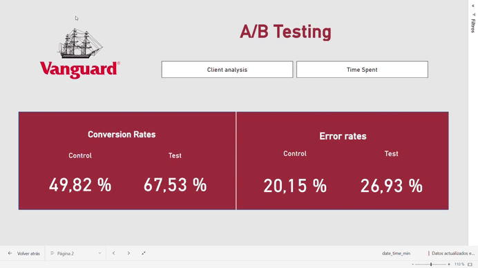

# Vanguard A/B Test

 

## Project Overview 

This project focuses on analyzing the outcomes of a digital experiment conducted by Vanguard, a leading investment management firm based in the United States. The objective is to evaluate whether a modernized and more intuitive user interface (UI), combined with timely contextual cues, can enhance online process completion rates for Vanguard customers.

The experiment utilized an A/B testing approach, comparing a control group that interacted with the traditional UI to a test group that used the redesigned UI. By examining the data collected from this experiment, the goal is to assess whether the updated UI contributed to a better user experience and increased process completion rates.

**Insights from our study**

- **Objective**: Increase task completion rates for online processes by enhancing user experience through an updated UI and contextual messaging.
- **Focus Areas**:
  - Completion rates comparison between test and control groups.
  - Analysis of error rates and time spent on steps.
  - Validation of hypothesis testing results.
- **Key Findings**
    - **Completion Rates:**
        - *Test Group:* 67.53%
        - *Control Group:* 49.82%
          
      The updated UI led to a statistically significant improvement in task completion rates.

    - **Error Rates:**
        - The error rates were consistent between groups, showing no significant increase in navigation issues.

     - **Time Spent on Steps:**
        - *Test Group:* Average of 95 seconds per step.
        - *Control Group:* Average of 87 seconds per step.
      
      Slightly higher engagement time in the test group may indicate increased interaction with the contextual cues.
          

## Relevant AB Testing Results in Power BI

The Power BI dashboard provides a comprehensive visualization of:

- Completion rates.

- Error rates.

- Time spent across steps.

- Demographics comparison (age, gender, account balance, and tenure).

## Functionality ⚙️

- 🧹 **Data Structure**: Organized datasets from client profiles, digital footprints, and experiment rosters were cleaned and merged into a unified dataset.
- 📈 **Data Visualization**: Insights were visualized using Power BI to illustrate trends and support hypothesis validation.

## Tools Used 🛠️

- 🐍 **Python**: Main programming language used for data processing and analysis.
- 🐼 **Pandas**: Library for data manipulation and analysis.
- 📊 **Matplotlib & Seaborn**: Libraries for data visualization.
- 📈 **Power BI**: Tool for creating interactive dashboards and visualizing data insights.
- 📓 **Jupyter Notebooks**: Interactive environment for data cleaning and visualization.
- 🌐 **Git**: Version control system for tracking changes and collaboration.

## Development Process 🚀

1. 🧹 **Data Cleaning**: Focus on creating new variables to better identify better client profile.
2. 🔍 **Data Analysis**: Conducted hypothesis testing and explored relationships between variables.
3. 📊 **Data Visualization**:  Power BI dashboards were used to communicate findings effectively.

## Conclusion 📊
Through comprehensive analysis, the project reveals critical insights:

1. The redesigned UI significantly improves completion rates, confirming the hypothesis.
2. Error rates remain stable, indicating that the changes did not introduce additional navigational challenges.
3. Slightly longer engagement times suggest that contextual cues encouraged users to explore their options more thoroughly.

## Project Structure 📁

- `clean_data/`:
    - `cleaning.ipynb`: Jupyther Notebook created to clean data.
    - `cleaning_celia.ipynb`: Jupyther Notebook created to clean data.
    - `mental_health_cleaning.ipynb`: Jupyther Notebook created to clean data.
    - `mental_health_symptoms_clean.csv`
    - `mental_health_therapy_clean.csv`
    - `patients.csv`
    - `sleep_lifestyle_clean.csv`
- `data_queries/`: csv created with sql queries to our visualization
    - `data_queries_ana`: data.
    - `data_queries_carlota`: data.
    - `data_queries_celia`: data.

- `original_data/`:
    - `Sleep_health_and_lifestyle_dataset.csv`.
    - `mental_health_diagnosis_treatment_.csv`.
  

  
- `visualizations/`: Folder with all grahps creates to analyse. All of them have been created in `visualization_df.ipynb` Jupyter Notebook.
    - `visualization_ana.ipynb`.
    - `visualization_carlota.ipynb`.
    - `visualization_celia.ipynb`.
- `sql_scripts/`:
    - `miniproject_ironhack_final.sql`.
    - `sql_script_all`: extra sql files.

- `presentation/`: 
  - `PDF_presentation/`: Folder to store PDF presentations.
- `README.md`: File to describe the project and how to set it up.
- `EDR_relation_sleep_and_mental_health.PNG`: Entity relational model.

## Project Presentation 🎤

The project findings are summarized in a detailed presentation, covering:

- 📋 Research goals and methodology.
- 🔍 Key insights and trends.
- 📊 Data visualizations and treatment analysis.

## Project Members 👥

| Name       | GitHub Profile                           |
|------------|------------------------------------------|
| **Celia Manzano** | [GitHub Profile](https://github.com/cemanzanoc) |
| **Carlota Gordillo** | [GitHub Profile](https://github.com/carlotagordillo2) |
| **Laura Sánchez** | [GitHub Profile](https://github.com/laurasanchez20) |
----

Feel free to reach out for any questions or suggestions!
